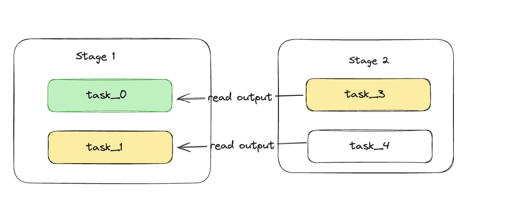

# Golem pipeline

Golem pipelines is library which allows to spawn golem tasks in declarative form, this approach unlocks some sexy features.

## Features
- **declarative** Declarative code should be easier to read/maintain/extend especially for highly parallelized tasks
- **composability** Cause of pipeline/stage/executable abstraction it is easy to build reusable tasks. This could intresting direction of development especially in web.
- **pipelining**  It means that `task_3` will start as soon as `task_0` finishes. We don't have to wait for `task_1`. The dependency is defined by `output <> input` variables between two or more tasks.
- **checkpointing** Every task result after successful execution is persisted. Thus we don't loose progress on interrupted pipelines. It also allows for iterative building new stages, without re-running already working stages over and over again.
  - `FsCheckPointer` - persists checkpoints to file system
  - `S3CheckPointer` - (TBD) interface can be easily implemented for S3  which would be good solution for browser execution
- **Input** Input abstraction allows to choose from different input resources 
  - `FileInput` - upload files to Provider, and pass path as args to command line
  - `ArgInput` - command line arguments
  - `S3Input` - (TBD) interface can be easily implemented for S3  which would be good solution for browser execution
- **Executable** Different modes of execution tasks, reduce boilerplate code
  - `ExecutableToStdout` - executes program and treats `stdout` as a result
  - `ExecutableToFiles`- allows producing multiple results (files) from single input

## Future improvements
- **visualization** - Such organized pipelines could be easly visualized using [graphs](https://www.npmjs.com/package/react-json-graph). Also bills etc. could be visualized in real time, by implementing event bus. I didn't make it in time :(
- **s3 interfaces** - I didn't make it in time :(

## Feedback for Golem team
- Really great experience. Most of the hhings were working out of the box. Interface (js-sdk) is very intuitive. Generally it was pleasure to this library. Good job!
- What could be better
  - More `stream API` both for uploading data to provider and for fetching. It would avoid copying data, and allow processing bigger files. (I had problem with `ctx.spawn` api I didnt managed to make it work)
  - I was getting error when tried to upload/download file concurrently
  - Global event bus for better observability

Checkout out example of using this library: [example](./example/README.md)