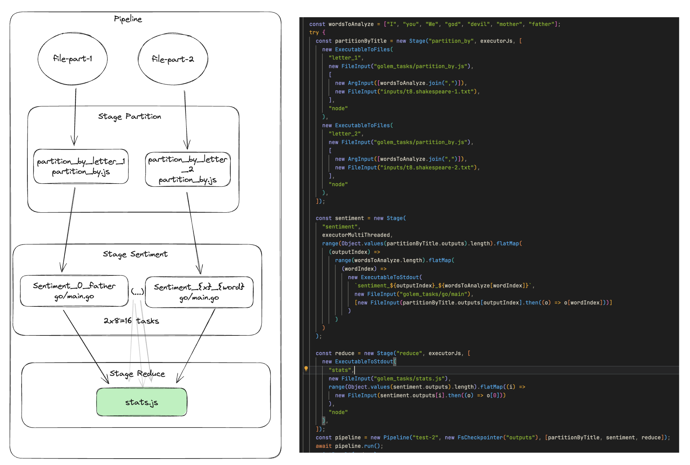

# Example

How to run: 
- `npm i`
- `ts-node example/main.ts`
Subsequent runs will be reusing checkpoints you can change. Clear `outputs` folder or change pipeline ID to prevent that.

1. In this example we have two files which contains William Shakespeare texts.
2. We first partition the sentences in this texts by given list of 8 words [ "I", "you", "We", "god", "devil", "mother", "father"]. We use for this [partition_by.js](../golem_tasks/partition_by.js). (2 parallel tasks)
3. As the result we got 2x8 outputs. For every output we create task with [go program](../golem_tasks/go/main.go) which in parallel score sentiment of every sentence. Score 1 => positive 0=> negative
4. The last stage is responsible for aggregating sentiments and generating report concluding that "the most positive word" in William Shakespeare poetry is "father" and the least is "god".

I understand that Golem is better suited for tasks that demand significant CPU and RAM resources rather than those involving extensive data transmission. Unfortunately, due to time constraints, I was unable to develop a more suitable example. The primary purpose of this example is to showcase the library's capabilities

## More then thousand words

[Check out example code](./main.ts)

